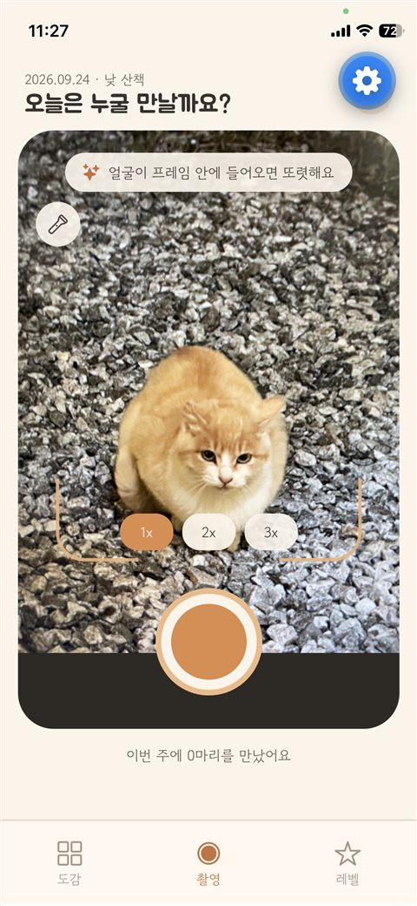
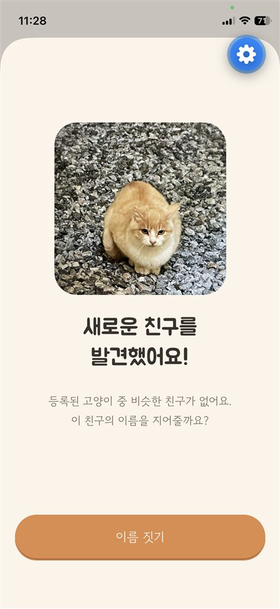
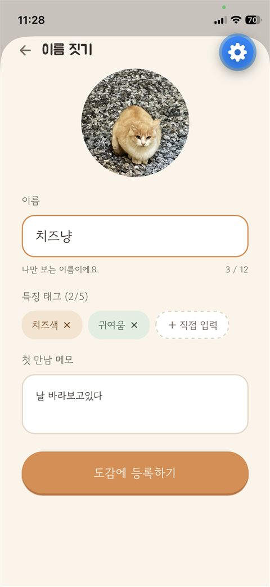
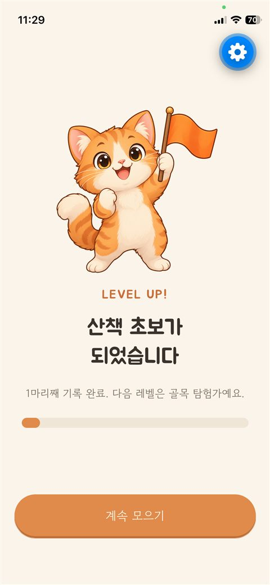
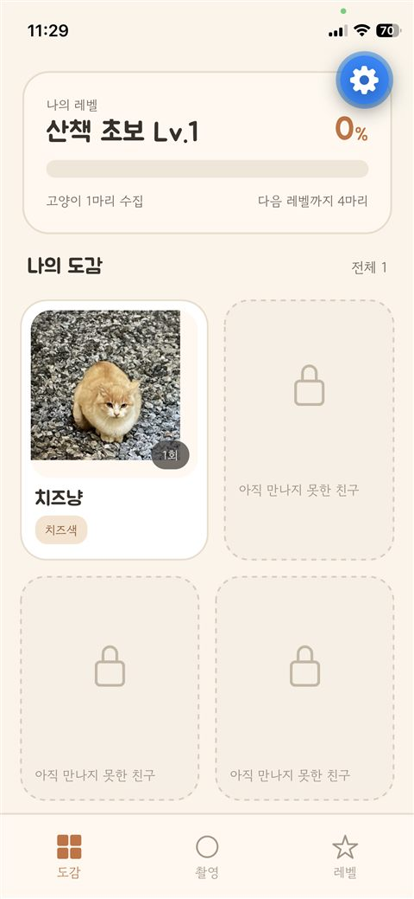
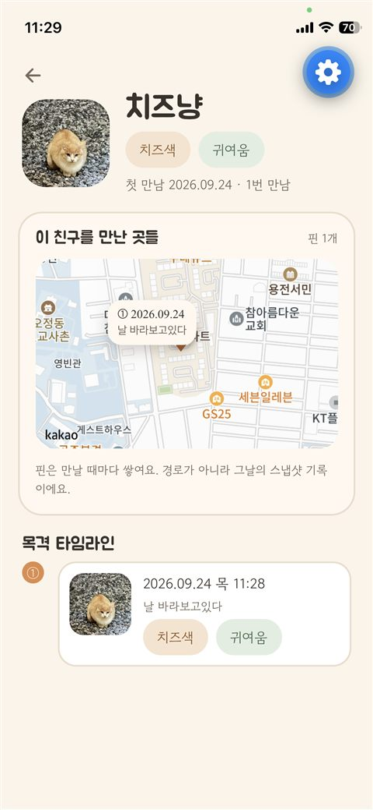
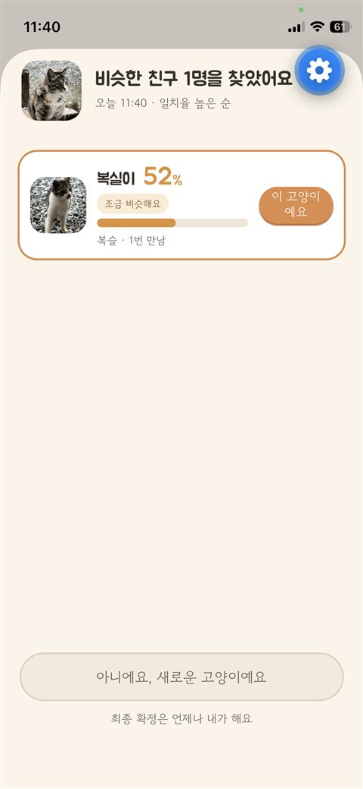
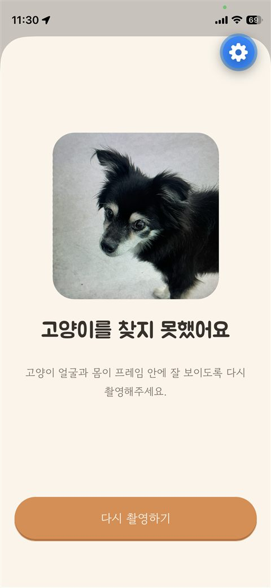
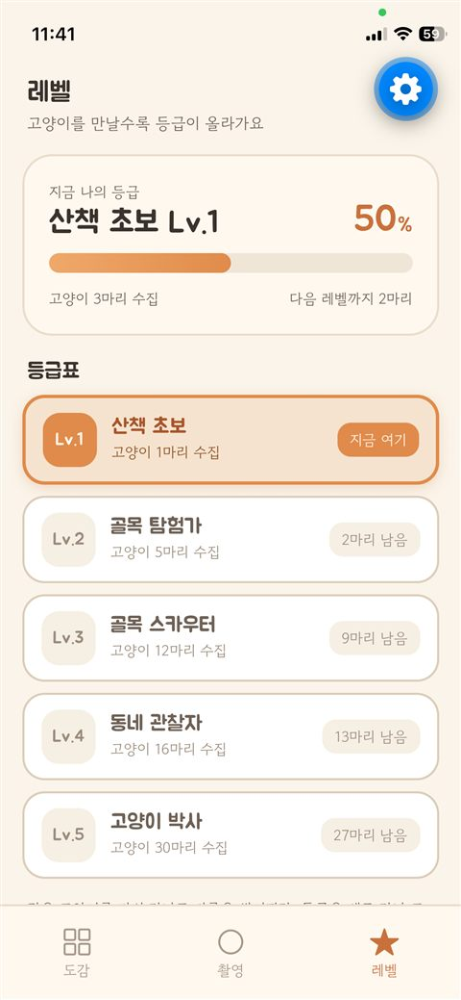
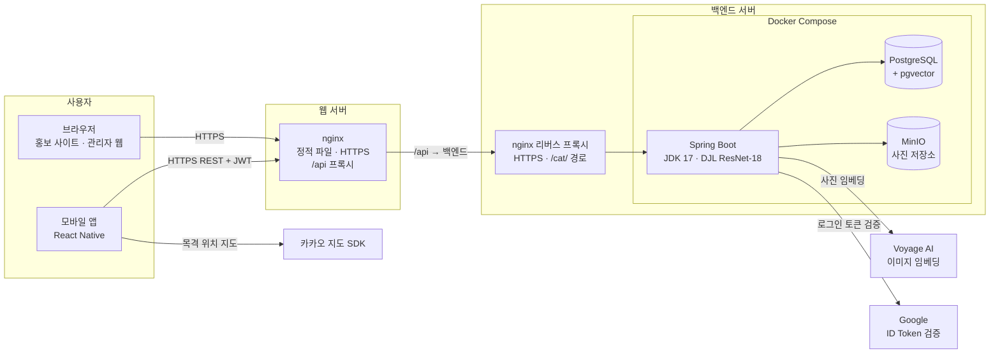

# 우리동네고양이

산책하며 마주친 길고양이를 사진으로 기록하는 **개인용 고양이 수집 다이어리**.
AI가 "예전에 등록한 고양이와 같은 개체인지"를 판별해서 알려주고, 사용자가 최종 확인하면 기록이 누적되는 구조입니다.

- **Whisker Tracker**(해외 사례)의 "개인 기록장" 철학을 벤치마킹
- 동네 커뮤니티 공유가 아니라 **철저히 개인용 도감** — 내가 찍은 고양이만 내 기록에 남음
- 포켓몬 도감처럼, 만난 고양이를 하나씩 모아가는 수집 재미

> **배포 상태**: 서버·홍보 웹은 배포 완료, 앱은 스토어 출시 준비 중(개발 빌드로 실기기 테스트) — 아직 Google Play·App Store에는 없습니다.
>
> **소개 사이트**: [https://mycat-town.duckdns.org](https://mycat-town.duckdns.org/) — 기능 소개·사용 방법·FAQ·[개인정보 처리 안내](https://mycat-town.duckdns.org/privacy)
>
> **화면 설계**: [시안 디자인 보기](https://github.com/Obok-2/cat-my-town/blob/main/design/%EC%9A%B0%EB%A6%AC%EB%8F%99%EB%84%A4%EA%B3%A0%EC%96%91%EC%9D%B4_%EB%AA%A9%EC%97%85.pdf) — 앱·관리자 웹 화면 시안 (PDF)

---

## 앱 화면

실제 앱 화면입니다. 아이폰에서 테스트용 Expo Go로 실행해 캡처했습니다(오른쪽 위 파란 버튼은 Expo Go 개발자 도구).
직접 촬영한 길고양이를 등록하고, 강아지 사진은 고양이가 아니라고 걸러내는 흐름입니다.

| 촬영 | 새 고양이 발견 | 이름·태그 등록 |
|:---:|:---:|:---:|
|  |  |  |

| 레벨업 | 도감 | 고양이 상세 (목격 지도·타임라인) |
|:---:|:---:|:---:|
|  |  |  |

| 기존 고양이 후보 제안 | 고양이 아님 판별 | 레벨 등급표 |
|:---:|:---:|:---:|
|  |  |  |

---

## 시스템 구성



- **앱과 관리자 웹** 모두 웹 서버 도메인의 `/api`로 요청하고, 웹 서버 nginx가 백엔드로 넘깁니다. 입구가 하나라 백엔드 주소가 드러나지 않고, 관리자 웹은 같은 도메인이라 CORS가 필요 없습니다.
- 서버·DB·사진 저장소는 한 Docker Compose로 묶고, DB·MinIO는 외부에 열지 않고 컨테이너 내부 주소로만 접속합니다.
- 사진 원본은 DB가 아니라 MinIO에 두고, DB에는 경로와 임베딩(1024차원 벡터)만 저장합니다.

**배포 환경**

| 구분 | 클라우드 · 사양 | 올라간 것 |
|---|---|---|
| 백엔드 서버 | Oracle Cloud (Ampere A1, **ARM64**) · 2 OCPU · 12 GB RAM · Rocky Linux 8 | nginx(공유), Docker Compose: Spring Boot, PostgreSQL + pgvector, MinIO |
| 웹 서버 | AWS Lightsail (서울) · 2 vCPU · 2 GB RAM · 60 GB SSD | nginx: 홍보 사이트·관리자 웹 정적 파일, `/api` 프록시 |

- 사이드 프로젝트라 비용을 줄이려고 서버를 새로 늘리지 않고, 이미 운영 중인 서버 자원에 함께 올렸습니다.

**웹 서버와 백엔드 서버를 나눈 이유**
원래는 한 서버에 모두 올리려 했지만, 백엔드 서버의 80·443 포트를 이미 다른 서비스의 nginx가 쓰고 있었습니다.
그 nginx를 공유하되 `/cat/` 경로만 이 서버로 넘기도록 분리했고(기존 서비스와 `/app/` 경로가 겹치지 않게),
홍보 사이트·관리자 웹은 별도 웹 서버에 두어 기존 서비스 설정에 영향을 주지 않도록 했습니다.

---

## 핵심 기능

### 고양이 판별 (사전 필터)
- 서버에서 **ResNet-18**(ImageNet 사전학습 이미지 분류 모델, DJL + PyTorch)로 사진 속 대상이 고양이인지 먼저 확인
- ImageNet의 고양이 계열 클래스(tabby cat, tiger cat, Persian cat, Siamese cat, Egyptian cat, lynx) 확률 합이 기준값(기본 0.15) 이상일 때만 다음 단계로 진행
- 고양이가 아닌 사진은 임베딩 생성 전에 걸러서 **외부 API 비용과 오등록을 방지**하고, 앱에는 다시 찍어 달라고 안내

### AI 매칭
- **임베딩**: Voyage AI `voyage-multimodal-3.5`로 목격 사진마다 1024차원 벡터 생성
- **검색**: pgvector 코사인 유사도, 본인 소유 고양이로 범위 제한
- **개체 점수**: 고양이마다 목격 사진 임베딩 중 유사도 상위 2개의 평균을 사용하고, 고양이별로 후보는 하나만
- **신뢰도 표시**: 원시 코사인 유사도를 그대로 노출하지 않고 보정한 값을 "일치율 %"로 표시 (아래 보정 로직 참고)
- **최종 판단은 항상 사용자**: AI는 "제안"만 하고, 등록/매칭 확정은 사용자가 버튼으로 결정
- 분석 때 만든 임베딩은 서버 메모리에 30분 보관해 등록할 때 재사용 — 같은 사진으로 Voyage API를 두 번 호출하지 않음

### 특징 태그·메모
고정된 카테고리(카오스/턱시도 등)로 제한하지 않고, 목격할 때마다 사용자가 자유 텍스트 태그를 최대 5개 붙입니다.
(예: "턱시도", "삼색이", "꼬리 짧음") 태그와 메모("놀이터 미끄럼틀 밑")는 목격 기록 단위로 저장됩니다.

### 레벨/도감 시스템
등록한 고유 개체 수 기준으로 레벨업합니다(같은 고양이를 다시 만나도 오르지 않음). 도감 화면 상단에 레벨 + 다음 레벨까지 진행률 바를 표시합니다.

| 레벨 | 호칭 | 필요 개체 수 |
|---|---|---|
| Lv.1 | 산책 초보 | 1~4마리 |
| Lv.2 | 골목 탐험가 | 5~11마리 |
| Lv.3 | 골목 스카우터 | 12~15마리 |
| Lv.4 | 동네 관찰자 | 16~29마리 |
| Lv.5 | 고양이 박사 | 30마리 이상 |

레벨은 등록한 고양이 수로 계산합니다(서버 `LevelPolicy` 한 곳에서 기준 관리). `users.level` 캐시 컬럼은 있지만, 사용자 수가 적은 지금은 매번 계산해도 부담이 없어 갱신하지 않습니다.

### 도감(컬렉션)·고양이 상세
- 등록한 고양이들을 그리드로 확인, 당겨서 새로고침
- 고양이 상세: 이름, 목격 타임라인(10건씩 추가 조회), 목격 위치 지도(카카오 지도, 경로선 없이 핀만)

---

## 신뢰도(%) 보정 로직

원시 코사인 유사도는 다른 개체 간에도 0.75~0.9대로 높게 나오는 경우가 많아 그대로 노출하면 오해 소지가 있습니다. Min-Max 정규화로 보정합니다.

```java
double calibrated = (rawSimilarity - LOWER_BOUND) / (UPPER_BOUND - LOWER_BOUND) * 100;
calibrated = Math.max(0, Math.min(100, calibrated));
```
- 기본값: `LOWER_BOUND` 0.75, `UPPER_BOUND` 0.92, 후보 기준 일치율 40% (원시 유사도 약 0.818 이상)
- 모두 `application.properties`의 `camera.match.*`로 조정

---

## 핵심 사용자 플로우

```
1. 로그인 (Google 로그인)
2. 카메라 화면으로 진입
3. 길고양이 사진 촬영 (긴 변 1280px·JPEG로 줄여서 서버 전송, 촬영 위치를 함께 기록 — 목격 지도의 핀이 되므로 카메라·위치 권한이 모두 있어야 촬영 진행)
4. AI 처리
   ├─ 고양이 여부 판별 (ResNet-18, ImageNet) — 고양이가 아니면 여기서 중단 (NOT_CAT)
   ├─ 이미지 임베딩 생성 (Voyage AI)
   ├─ 내 기존 등록 고양이들과 유사도 비교 (pgvector, 본인 데이터 내에서만 검색)
   └─ 일치율 40% 이상인 후보를 최대 3마리까지 제시 (없으면 NEW_CAT)
5. 사용자 최종 판단
   ├─ 후보 중 하나 선택 → 메모·특징 태그를 적어 기존 개체에 목격 기록(sightings) 추가
   └─ [새로운 고양이예요] → 신규 개체(cats) 등록, 이름 짓기
6. 완료 화면(레벨업·신규 등록·목격 기록) → 도감에서 그동안 모은 고양이 확인
```

---

## 기술 스택

**백엔드**
- Spring Boot 3.5 (JDK 17) / MyBatis
- Spring Security + 자체 JWT(HS256, 7일) — Google ID Token을 서버가 검증한 뒤 발급
- Docker / Docker Compose, Nginx 리버스 프록시(HTTPS)

**데이터 저장**
- PostgreSQL 16 + pgvector (`pgvector/pgvector` 이미지)
- 이미지 저장: MinIO (S3 호환)

**AI**
- 고양이 판별(사전 필터): ResNet-18 ImageNet (DJL + PyTorch, 서버 추론)
- 이미지 임베딩: Voyage AI (voyage-multimodal-3.5)
- 벡터 검색: pgvector HNSW 인덱스 (사용자별 스코프 제한)

**앱**
- React Native (Expo, JavaScript)
- expo-camera, expo-image-manipulator, expo-location, expo-splash-screen
- Google 로그인(네이티브 모듈이라 Expo Go가 아닌 Development Build 필요), 토큰은 SecureStore에 보관
- 카카오 지도 JS SDK (네이티브는 WebView, 웹은 페이지에 직접 로드)
- 서버 호출은 axios

**홍보 사이트 · 관리자 웹**
- React + Vite (JavaScript), [https://mycat-town.duckdns.org](https://mycat-town.duckdns.org/)에 배포
- `/`: 앱 소개·사용 방법·FAQ·출시 준비 안내를 담은 원페이지 홍보 사이트
- `/privacy`: 개인정보 처리 안내
- `/admin`: 관리자 로그인·대시보드 — 서버 API에 연결되어 실제 데이터로 동작
  - 로그인: `admin_users`(BCrypt) 계정으로 관리자 전용 JWT 발급, 앱 사용자 토큰과 분리(앱 토큰으로 관리자 API 호출 불가)
  - 대시보드: 누적·30일 신규 사용자, 7일 활성 사용자, 등록 고양이, 오늘·어제 촬영 수, 최근 7일 추이, 레벨 분포, 최근 로그인(이메일 일부 가림)
  - 사용자·고양이 관리 등 나머지 메뉴는 준비 중
- API는 같은 도메인의 `/api`로 호출하고, 웹 서버 nginx가 백엔드로 프록시(브라우저에 백엔드 주소를 노출하지 않고 CORS 없이 동작)
- nginx SPA fallback(`try_files … /index.html`)으로 `/admin/*`·`/privacy` 직접 접속과 새로고침 지원
- 외부 라우터·차트 라이브러리 없이 라우터와 CSS 차트를 직접 구현

---

## 개인정보

- 계정 정보는 **Google 이메일과 Google 계정 고유 ID(UID)만** 수집하고, 이름은 수집하지 않습니다.
- 고양이 사진·목격 기록(위치 포함)은 본인에게만 보이고 다른 사용자에게 공개되지 않습니다.
- 동일 개체 비교를 위해 촬영 사진이 Voyage AI로 전송됩니다.
- 자세한 내용: [개인정보 처리 안내](https://mycat-town.duckdns.org/privacy)

---

## 알려진 기술적 한계

- 범용 임베딩 모델은 **동일 무늬 개체 간 미세 구분**에 한계가 있습니다
  (예: 카오스 무늬 고양이 두 마리를 헷갈릴 수 있음)
- 대응: 자동 확정 대신 **항상 사용자 최종 확인 UX**로 설계해 오매칭 리스크를 사용자 판단으로 보완
- ImageNet의 고양이 계열 클래스는 6개뿐이라, 무늬가 특이하거나 몸이 많이 가려진 고양이는 판별 확률이 낮게 나올 수 있음 → 기준값 튜닝, 필요하면 길고양이 사진으로 파인튜닝
- 참고 연구: 동물 개체 재식별 전문 모델 MegaDescriptor(WACV 2024) 대비, 현재는 범용 임베딩(Voyage AI)을 사용 — 향후 전문 모델 도입 검토 가능

---

## 화면 구성

| 화면 | 설명 |
|---|---|
| 로그인 | Google 로그인 |
| 카메라 | 촬영, 최근 7일 목격 횟수·만난 고양이 수 표시 |
| 매칭 결과 | 후보 최대 3마리 + 일치율 % + [새로운 고양이예요] 버튼 |
| 이름 짓기 | 신규 등록 시에만 노출 |
| 목격 기록 작성 | 기존 고양이 선택 시 메모·특징 태그(최대 5개) 입력 |
| 완료 | 레벨업 / 신규 고양이 / 목격 기록 세 가지 상태별 안내 |
| 도감(컬렉션) | 그리드 뷰, 상단 레벨/진행률 표시 |
| 고양이 상세 | 이름, 목격 타임라인, 목격 위치 지도 |
| 레벨 | 5단계 등급표, 현재·달성 등급 표시 |
| 프로필 | 로그인 계정(이메일)·레벨 표시, 로그아웃 |

---

## DB 스키마 (단순화 버전)

전체 정의는 [`산출물/schema.sql`](산출물/schema.sql) 참고.

```sql
users
- id
- google_uid (검증된 Google ID Token의 sub)
- display_name (Google 이메일 — 이름은 수집하지 않음)
- level (캐시용 컬럼, 현재는 갱신하지 않고 고양이 수로 계산)
- created_at
- last_login_at (마지막 로그인, 로그인할 때마다 갱신)

cats
- id
- user_id (FK, 이 고양이를 등록한 사용자)
- name
- created_at (첫 만남)

sightings
- id
- cat_id (FK)
- photo_url (MinIO 객체 경로)
- embedding (목격 사진별 Voyage AI 임베딩, 1024차원)
- memo
- tags (쉼표 구분 최대 5개)
- latitude / longitude (소수 5자리로 반올림)
- taken_at (촬영일시)

admin_users
- id, email, password_hash (BCrypt), name, role — 관리자 웹 로그인 계정 (가입 기능 없이 DB에 직접 등록)

match_logs / match_candidates
- AI 매칭 결과와 보여준 후보를 남기기 위한 테이블 (아직 기록하지 않아 대시보드에 매칭 통계는 없음)
```

---

## 프로젝트 구조

```
app/     React Native(Expo) 앱
server/  Spring Boot / MyBatis 백엔드
web/     홍보 사이트 · 관리자 웹 (React + Vite)
infra/   Docker Compose (PostgreSQL + pgvector, MinIO, 서버 컨테이너, 웹 Nginx)
design/  화면 시안 · 목업
산출물/  DB 스키마(schema.sql), 앱·관리자 REST API 인터페이스 정의서
docs/    진행상황
```
